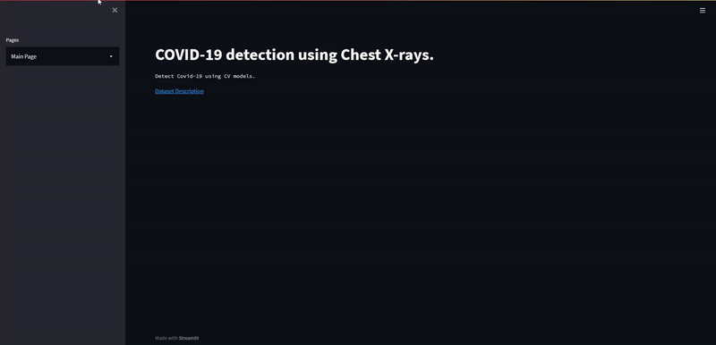
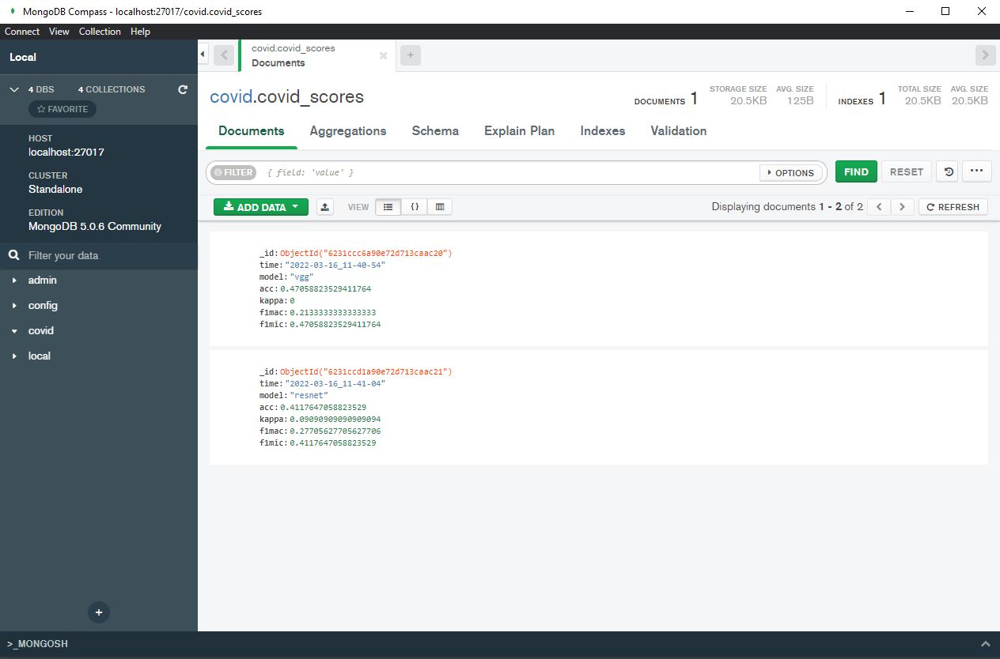

# COVID-19 detection using Chest X-rays

Code contains a pipeline for prediction one image and validate batch images by using TF (keras), FastAPI, streamlit and MongoDB.

[Data source](https://www.kaggle.com/pranavraikokte/covid19-image-dataset)

## Folder Structure
```
├───assets
├───backend
├───data
│   ├───test
│   │   ├───Covid
│   │   ├───Normal
│   │   └───Viral Pneumonia
│   └───train
│       ├───Covid
│       ├───Normal
│       └───Viral Pneumonia
├───frontend
└───models
```


## Installation
There are only two prerequisites:

* [Docker](https://docs.docker.com/get-docker/)
* [Docker-compose](https://docs.docker.com/compose/install/)

<br>

``` bash
git clone https://github.com/silverstone1903/covid19-detection-pipeline
```

## Usage
### Start 

``` bash
docker-compose up -d
```

If you make any changes you can add `--build`. 

``` bash
docker-compose up --build -d
``` 

### Stopping containers

``` bash
docker-compose down -v
```
### Container Logs
When running containers with detached mode (`-d`) they work in the background thus you can't see the flowing logs. If you want to check compose logs with cli you can use `logs`.

``` bash
docker-compose logs --tail 50
```

* FastAPI (UI): http://localhost:8000
* Streamlit: http://localhost:8501

### UI
<p>
<p style="text-align:center">
 
 
</p>


